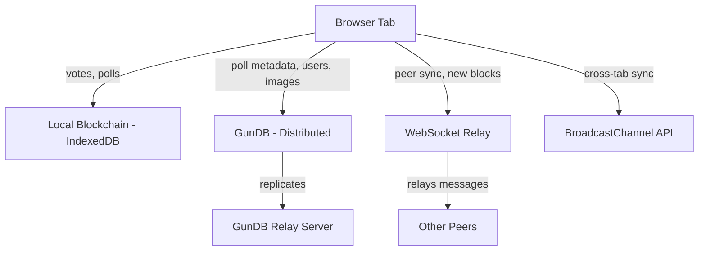
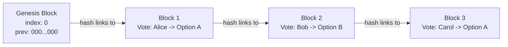

# Intepoll

A decentralized polling platform. Votes are recorded on a local blockchain, poll data lives in a distributed database (GunDB), and peers find each other through a lightweight WebSocket relay. Everything works offline -- sync happens when a connection is available.

## Quick start

You need two things running: the frontend dev server and the relay server.

```bash
# Terminal 1 -- relay server
node relay-server.js

# Terminal 2 -- frontend
npm install
npm run dev
```

The app opens at `http://localhost:5173`. The relay listens on port 8080.

If you want the GunDB relay as well (for distributed persistence across devices):

```bash
cd gun-relay-server
npm install
node gun-relay.js
```

### Environment variables

The frontend reads these at build time (prefix with `VITE_`):

| Variable | Default | Purpose |
|---|---|---|
| `VITE_WS_RELAY_URL` | `ws://localhost:8080` | WebSocket relay |
| `VITE_GUN_RELAY_URL` | `http://localhost:8765/gun` | GunDB relay |
| `VITE_API_BASE_URL` | `http://localhost:8080` | Backend API |

You can also change relay URLs at runtime from the Settings page. Those overrides are saved in localStorage and take priority.

The relay server reads these directly from the environment:

| Variable | Default | Purpose |
|---|---|---|
| `FRONTEND_ORIGIN` | `http://localhost:5173` | CORS origin |
| `GOOGLE_CLIENT_ID` | -- | Google OAuth app ID |
| `GOOGLE_CLIENT_SECRET` | -- | Google OAuth secret |
| `MS_CLIENT_ID` | -- | Microsoft OAuth app ID |
| `MS_CLIENT_SECRET` | -- | Microsoft OAuth secret |
| `MS_TENANT` | `common` | Azure AD tenant |

OAuth is optional. The app works fine without it. Polls can optionally require login to vote -- that is the only feature gated behind OAuth.

### Build commands

```bash
npm run dev       # Start Vite dev server
npm run build     # Type-check + production build
npm run preview   # Serve the built dist/ folder locally
```

## How it works

The system has four layers that each handle a different concern.



### The blockchain

Every vote gets recorded as a block in a local chain stored in IndexedDB. The chain is append-only and tamper-evident.

A block looks like this:

```
index:        sequential number (0 for genesis)
timestamp:    when the block was created
previousHash: SHA-256 of the block before it
voteHash:     SHA-256 of the vote data (pollId + choice + deviceId + timestamp)
signature:    SHA-256 of {index, voteHash, previousHash} + signing key
currentHash:  SHA-256 of the entire block
```

When someone casts a vote:

1. The vote data is hashed with SHA-256
2. A new block is created linking to the previous block's hash
3. The block is signed and its own hash is computed
4. The block and vote are saved to IndexedDB
5. A BIP-39 mnemonic (12 words) is generated as a receipt
6. The block is broadcast to other peers via WebSocket and BroadcastChannel

Validation walks the entire chain and checks that every block's previousHash matches the preceding block's currentHash, every block's own hash recomputes correctly, and signatures verify. If any block has been tampered with, the chain breaks.



### Vote verification

After voting, users get a 12-word mnemonic receipt (BIP-39 standard, same as cryptocurrency wallets). This receipt maps to a specific block in the chain. Anyone can look up a receipt in the Chain Explorer to verify that their vote was recorded and has not been altered.

### Anti-fraud

Duplicate voting is prevented at multiple levels:

- **Device fingerprinting.** A SHA-256 hash of browser properties (user agent, screen size, timezone, canvas fingerprint) creates a persistent device ID. The app tracks which polls each device has voted on.
- **Backend authorization.** If the relay server is reachable, it maintains an in-memory registry of `pollId:deviceId` pairs and rejects duplicates. This is a second line of defense -- the app still works if the backend is down.
- **Invite codes.** Private polls generate single-use alphanumeric codes. Each code is marked as consumed atomically in GunDB when used.
- **OAuth gating.** Polls can optionally require a Google or Microsoft login before accepting a vote.

### Data distribution

Poll metadata, communities, user profiles, posts, comments, and images all live in GunDB -- a distributed, eventually-consistent database. Each browser keeps a local copy and syncs with a GunDB relay server. If the relay goes down, data persists locally and syncs when the relay comes back.

Images are compressed client-side (max 500KB, thumbnails at 20KB), base64-encoded, and stored as GunDB nodes.

### Peer sync

The WebSocket relay handles peer discovery and message broadcasting. When a peer connects, it:

1. Registers with a random peer ID and joins the default room
2. Announces its relay URLs to other peers
3. Shares its list of known servers (so peers can discover alternative relays)
4. Requests a full chain sync from existing peers

When a new block is created, it is broadcast to all connected peers who merge it into their local chains. The BroadcastChannel API handles the same sync between tabs in the same browser, no network needed.

Peers can discover and switch between relay servers at runtime from the Settings page. Known servers accumulate as peers share their configurations with each other.

### OAuth login

Login is optional and only required for polls that have the "require login" flag set.

The flow uses standard OAuth 2.0 authorization code grant. The relay server acts as the OAuth backend -- it redirects the user to Google or Microsoft, exchanges the authorization code for an ID token, extracts the user profile, and sets an HTTP-only session cookie. The frontend caches the authenticated user in localStorage so the login survives page refreshes and works even if the backend becomes temporarily unreachable.

## Project layout

```
src/
  components/     UI components (VoteForm, PollCard, PostCard, etc.)
  views/          Page-level components (HomePage, VotePage, SettingsPage, etc.)
  services/       Core logic -- blockchain, GunDB, WebSocket, crypto, storage
  stores/         Pinia state stores (chainStore, pollStore, communityStore, etc.)
  router/         Vue Router configuration
  config.ts       Centralized config with runtime-mutable relay URLs

relay-server.js   WebSocket relay + OAuth + vote authorization backend
gun-relay-server/
  gun-relay.js    GunDB relay server
```

Key services:

| File | What it does |
|---|---|
| `chainService.ts` | Block creation, hashing, signing, chain validation |
| `gunService.ts` | GunDB read/write/subscribe wrapper |
| `websocketService.ts` | WebSocket connection, peer discovery, server list sharing |
| `broadcastService.ts` | Cross-tab sync via BroadcastChannel |
| `pollService.ts` | Poll CRUD, invite code generation and validation |
| `voteTrackerService.ts` | Device fingerprinting, duplicate vote prevention |
| `cryptoService.ts` | SHA-256 hashing, BIP-39 mnemonic generation |
| `auditService.ts` | OAuth login/logout, backend vote authorization |
| `storageService.ts` | IndexedDB wrapper for blocks, votes, receipts |
| `pinningService.ts` | Storage policies and quota management |
| `ipfsService.ts` | Image compression, upload, and retrieval via GunDB |
